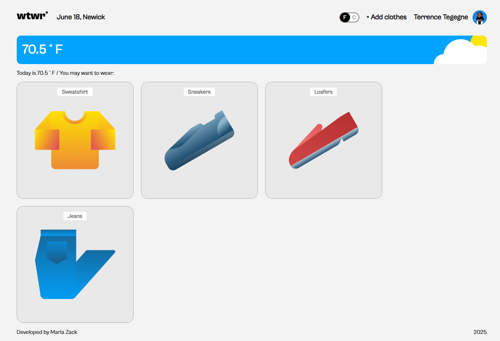

# WhatWhere project

An interactive weather app that shows temperature and suggests clothing. Users can add and manage clothing items.

## 🛠 Technologies

- React + Vite
- React Router
- CSS Grid
- Prettier + ESLint

## 💻 Features

- Add/remove clothing items
- Temperature toggle (°F / °C)
- Profile page

## 📸 Screenshots

## 🔗 GitHub Pages

https://mashagabri.github.io/se_project_react/
